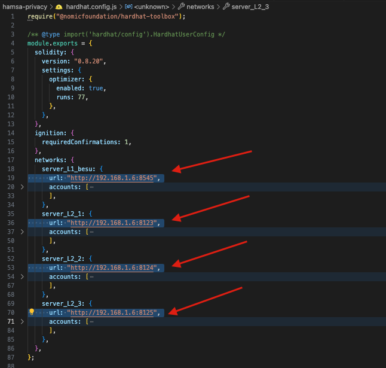
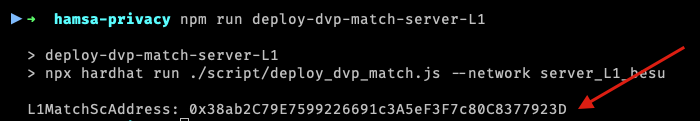
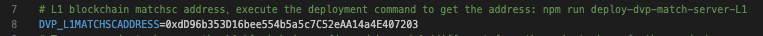
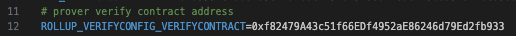
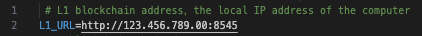

# Configuração do ambiente Demo

1. Realize a extração do aquivo abaixo:
   
   ```hamsa-msft-demo.zip```

2. Através de linha de comando, acesse o diretório:
    ```bash
    cd hamsa-msft-demo
    ```
### Configuração do arquivo hardhat.config.js

1. Abra o arquivo hardhat.config.js em seu software de edição de preferência e atualize-o com os IPs/URI:
   1. server_L1_besu: IP/URI do Hyperledger Besu (Layer 1);
   2. server_L2_1: IP/URI referente ao Node Layer 2 do Bacen/SELIC;
   3. server_L2_2: IP/URI referente à instituição A;
   4. server_L2_3: IP/URI referente à instituição B;
   
   <br/>

   > <small>Para os testes desta demo é necessário manter os valores referentes às portas. Exemplo: Besu:8545, Nodes: 8123, 8124 e 8125, imagem abaixo:</small>
   
    

2. Para testes já existentes nesta demo, as chaves privadas das contas na Layer 1 não precisam ser modificadas. Caso você esteja usando sua própria blockchain Layer 1, atualize o arquivo com as sua próprias chaves.


### Compilação dos smart contracts, Implantação do DVP-Match e Rollup na Layer 1

1. Execute os seguintes comandos para realizar instalação das dependências e compilar os smart contracts
    
    > instalação das dependências
     ```bash
    npm i
    ```

    > compilação dos smart contracts
    ```bash
    npx hardhat compile
    ```
2. Implantação do servidor DVP-Match, execute o comando abaixo:

    ```bash
    npm run deploy-dvp-match-server-L1
    ```

    O resultado esperado será seguindo o seguindo o exemplo abaixo:

    
    

3. Um endereço `L1MatchScAddress` será gerado e será necessário atualizar o arquivo `.env` existente em cada Node (instituição).
   - Localize no arquivo `./server/node{1,2 ou 3}/.env` a variável de ambiente: `DVP_L1MATCHSCADDRESS`;
   - Atualize o valor existente pelo valor de `L1MatchScAddress`, destacado acima;

4. Implantação do servidor de Rollup, execute o comando abaixo:
    ```bash
    npm run deploy-rollup-server-L1
    ```

    
    

    - Localize no arquivo `./server/node{1,2 ou 3}/.env` a variável de ambiente: `ROLLUP_VERIFYCONFIG_VERIFYCONTRACT`;
    - Atualize o valor existente pelo valor destacado acima;

5. No mesmo arquivo `./server/node{1,2 ou 3}/.env` do Node, localize a variável `L1_URL` e atualize com o endereço de IP/URI do servidor Layer 1 (Hyperledger Besu utlizado).
    
    


----


<div class="footer">
<p><a href="./Nodes_Deployment.md">Implantação dos Nodes</a></p>
<p><a href="./Layer2_Nodes.md">ZK-Rollup - Camada 2</a></p>
<p><a href="./README.md">Inicio</a></p>
</div>


