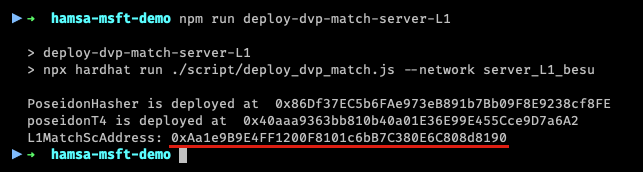

# Configuração do ambiente Demo

1. Faça o download do arquivo do link abaixo e extraia seu conteúdo:
   
   ```hamsa-privacy-demo.zip```

2. Pelo prompt de comando, acesse o diretório:
    ```bash
    cd hamsa-privacy-demo
    ```
### Configuração do arquivo hardhat.config.js

1. Abra o arquivo hardhat.config.js em seu software de edição de preferência e atualize-o com o IP do docker host.

    

2. As chaves privadas das contas na Layer 1 não precisam ser modificadas. Caso você esteja usando sua própria blockchain Layer 1, atualize o arquivo com as sua próprias chaves.

### Compilação dos smart contracts, Implantação do DVP-Match e Rollup na Layer 1

1. Execute os seguintes comandos para realizar instalação das dependências e compilar os smart contracts
    
    > instalação das dependências
     ```bash
    npm i
    ```

    > compilação dos smart contracts
    ```bash
    npx hardhat compile
    ```
2. Implantação do DVP-Match e Rollup, execute o comando abaixo:

    ```bash
    npm run deploy-dvp-match-server-L1
    ```

    O resultado esperado será seguindo o seguindo o exemplo abaixo:

    

3. Um endereço `L1MatchScAddress` será gerado para substituir os campos
   1.  `DVP_L1MATCHSCADDRESS` no arquivo `.env` que consta na pasta raiz do ambiente demo.
   2.  `DVP_L1MATCHSCADDRESS` nos arquivos `.env` que estão nas pastas de cada node em `./server/node1`, `./server/node2` e `./server/node3`.


> ### Por que temos mais de um arquivo `.env`?
> 
> *O deploy dos nodes pode ser feito através do arquivo `./docker-compose.yml` localizado na raiz do diretório da demo, onde todos os node são implantados em lote. Mas há possibilidade de deploy dos nodes de forma isolada  desde que o arquivo `.env` de cada node seja devidamente atualizado com o `DVP_L1MATCHSCADDRESS` gerado no deploy da Layer 1.*


----


<div class="footer">
<p><a href="./Nodes_Deployment.md">Implantação dos Nodes</a></p>
<p><a href="./Layer2_Nodes.md">Layer 1 - Node privado</a></p>
<p><a href="./README.md">Inicio</a></p>
</div>


