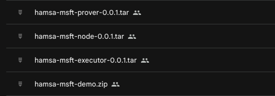

# <a name="layer-1---hyperledger-besu"></a> Hyperledger Besu - Camada 1

> Passo opcional, caso já tenha instalado o Besu, prosseguir para o  passo [Node privado - Layer 2](./Layer2_Nodes.md)

> **No caso de uso da emulação da Layer 1, o requisito mínimo para a emulação é:** \
> *Máquina Virtual com ao menos 4 vCPUs/core e 8Gb de memória RAM* 

<br/>

Já com acesso à maquina virtual realizado prossiga com os passos abaixo para a instalação:

1. Faça o download do arquivo ```besu-qbft-docker.zip``` e extraia seu conteúdo.
2. Execute o comando abaixo para que o ambiente de Layer 1 esteja já disponível para os próximos passos.s
  ```bash
  cd [nome da pasta extraida]

  docker compose up -d
  ```
3. Para conferir se o servidor está rodando execute o comando abaixo e localize o termo ```besu-qbft-docker```
  ```bash
  docker ps --format '\nName: {{.Names}} is running:  {{.Status}} | Image: {{.Image}}\n'
  ```



1. Certifique-se guardar o endereço IP ou URI deste serviço que deverá ser usado nas etapas seguinte.


## Troubleshooting

1. Se durante a inicialização do serviço houver um retorno semelhante ao abaixo:
  ```
  validator4-1  | Supplied genesis block does not match chain data stored in /opt/besu/data.
  validator4-1  | Please specify a different data directory with --data-path, specify the original genesis file with --genesis-file or supply a testnet/mainnet option with --network.
  validator4-1  |
  validator4-1  | To display full help:
  validator4-1  | besu [COMMAND] --help
  validator4-1  | 2024-09-09 21:20:32.982+00:00 | main | ERROR | Besu | Failed to start Besu
  validator4-1  | picocli.CommandLine$ExecutionException: Supplied genesis block does not match chain data stored in /opt/besu/data.
```

**Realize o seguinte procedimento por linhe de comando:**

  ```bash
  cd [nome da pasta extraida]

  rm -Rf ./data/validator{1,2,3,4}/*
  ```

2. Todas as vezes em que este serviço tiver seus dados apagados, deverá ser realizado um [novo deploy da DvP Match e Rollup, registrar o Hash novamente nos Nodes (Passo 2 da Compilação dos smart contracts)](./Environment_Setup.md#compilação-dos-smart-contracts-implantação-do-dvp-match-e-rollup-na-layer-1).


## Finalização das configurações

Para finaliar a configuração da camada 1 (Hyperledger Besu), utilizar os arquivos config.toml e genesis.json [veja aqui a documentação do BACEN](https://github.com/bacen/pilotord-kit-onboarding).

----

<div class="footer right">
  <p><a href="./Layer2_Nodes.md">Node privado - Layer 2</a></p>
  <p><a href="./Installation.md">Instalação</a></p>
  <p><a href="./README.md">Inicio</a></p>
</div>
