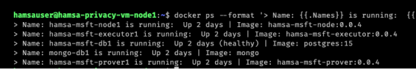

# Implantação os Nodes

> Os parâmetros de configuração necessários para cada node são declarados em arquivos `.env`. No arquivo `hardhat.config.js` já existem chaves privadas representando contas.
>
> `DVP_L1MATCHSCADDRESS` deve ter o mesmo valor nos 3 nodes
> `DVP_L1MATCHSUBMITTERKEYS`: Cada node deve preencher com 2 chaves privadas que estejam no arquivo `hardhat.config.js`, desde que não tenham sido usadas em outros nodes.
> `L1_DEPLOYERKEY`: deve ser preenchido por uma das chaves do arquivo `hardhat.config.js`, ser diferente das chaves usadas em `DVP_L1MATCHSUBMITTERKEYS` e não ter sido usada em outro nó da mesma forma.
>
> ATENÇÃO: As chaves mencionadas acima devem estar no arquivo `hardhat.config.js` em `networks.[NODE SERVER | EVM].accounts`


Após o preenchimento requerido na [etapa anterior](./Environment_Setup.md) para cada Node, cada um poderá ser inicializado:

#### <a name="starting-up-node"></a>Inicializando cada Node em sua determinada máquina virtual.

1) Através de acesso à linha comando dentro de cada máquina virtual e dentro da pasta 

    ```bash
    docker compose up -d
    ```

2) Conferindo a inicialização de todos os serviços: Node, Executor e Prover (Rollup):

    ```bash
    docker ps --format '> Name: {{.Names}} is running:  {{.Status}} | Image: {{.Image}}'
    ```

    

O resultado semelhante a imagem acima afirma que os serviços foram inicializados.


### Troubleshooting

1) Em caso de atualização do versão das imagens, se faz necessário:
    - interromper os serviços;
    - carregar as novas imagens no respositório docker da respectiva máquina virtual;
    - atualizar o arquivo .env com as devidas versões; 
    - se necessário limpar a base de dados (volume apontado para a pasta ./data do respectivo Node);
    - inicializar novamente os serviços

----

<div class="footer">
<p><a href="./Environment_Setup.md">Configuração do ambiente Demo</a></p>
<p><a href="./README.md">Inicio</a></p>
</div>