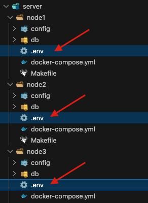
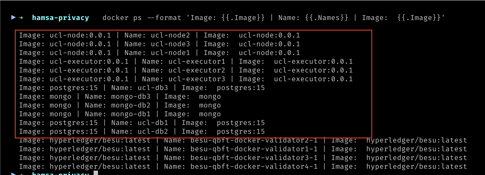
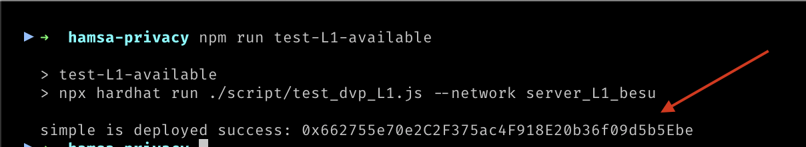
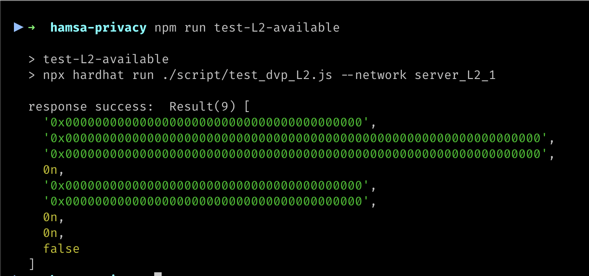

# Implantação os nodes

Abaixo serão implantados 3 nodes, Banco A, Banco B e Banco Central/SELIC. O processo é semelhante para todos os nodes.

Os parâmetros de configuração necessários para cada node são declarados em arquivos `.env`. No arquivo `hardhat.config.js` já existem chaves privadas representando contas.

 

> `DVP_L1MATCHSCADDRESS` deve ter o mesmo valor nos 3 nodes
> `DVP_L1MATCHSUBMITTERKEYS`: Cada node deve preencher com 2 chaves privadas que estejam no arquivo `hardhat.config.js`, desde que não tenham sido usadas em outros nodes.
> `L1_DEPLOYERKEY`: deve ser preenchido por uma das chaves do arquivo `hardhat.config.js`, ser diferente das chaves usadas em `DVP_L1MATCHSUBMITTERKEYS` e não ter sido usada em outro nó da mesma forma.
>
> ATENÇÃO: As chaves mencionadas acima devem estar no arquivo `hardhat.config.js` em `networks.server_L1_besu.accounts`

### Implantação rápida

Para que em um processo só os 3 nodes sejam implantados no mesmo ambiente (exemplo: docker local) siga os passos abaixo:

1. Abra o arquivo `.env` localizado na raiz do diretório;
2. Altere as variáveis abaixo:
   - `L1_URL`: Endereço do serviço Layer 1.
   - `DVP_L1MATCHSCADDRESS`: Hash de implantação da Layer 1 (veja em: [Compilação dos smart contracts, Implantação do DVP-Match e Rollup na Layer 1](#dvp-math-hash))
   
   Execute o comando abaixo para implantar todos os serviços juntos:
    ```bash
    docker compose up -d
    ```

    > Não esqueça de conferir se todos os serviços foram iniciados. Por exemplo: `docker ps --format 'Image: {{.Image}} | Name: {{.Names}} | Image:  {{.Image}}'`

    

### Implantando os nodes de modo segregado

#### <a name="central-bank"></a>Banco Central/SELIC
> ./server/node1

Altere os valores das variáveis de ambiente abaixo no arquivo `.env`:

1. `L1_URL`: Endereço do serviço Layer 1.
2. `DVP_L1MATCHSCADDRESS`: Hash de implantação do DVP-Match (veja em: [Compilação dos smart contracts, Implantação do DVP-Match e Rollup na Layer 1](#dvp-math-hash)).

Execute o comando abaixo ainda na pasta:

```bash
docker compose up -d
```


#### <a name="bank-a"></a>Banco A
> ./server/node2

Altere os valores das variáveis de ambiente abaixo no arquivo `.env`:

1. `L1_URL`: Endereço do serviço Layer 1.
2. `DVP_L1MATCHSCADDRESS`: Hash de implantação do DVP-Match (veja em: [Compilação dos smart contracts, Implantação do DVP-Match e Rollup na Layer 1](#dvp-math-hash)).

Execute o comando abaixo ainda na pasta:

```bash
docker compose up -d
```


#### <a name="bank-b"></a>Banco B
> ./server/node3

Altere os valores das variáveis de ambiente abaixo no arquivo `.env`:

1. `L1_URL`: Endereço do serviço Layer 1.
2. `DVP_L1MATCHSCADDRESS`: Hash de implantação do DVP-Match (veja em: [Compilação dos smart contracts, Implantação do DVP-Match e Rollup na Layer 1](#dvp-math-hash)).

Execute o comando abaixo ainda na pasta:

```bash
docker compose up -d
```

## <a name="testing-availability"></a>Testing availability of the services:

### Testando a disponibilidade da Layer 1

Execute o comentao abaixo:

```bash
npm run test-L1-available
```

Resultado esperado



### Testando a disponibilidade dos nós da Layer 2

Execute o comentao abaixo:

```bash
npm run test-L2-available
```




----

<div class="footer">
<p><a href="./Environment_Setup.md">Configuração do ambiente Demo</a></p>
<p><a href="./README.md">Inicio</a></p>
</div>