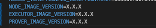

# ZK-Rollup Deployment

#### Deployment scenarios

[ZK-Rollup deployment on a dedicated virtual machine instance](#starting-up-node)

[ZK-Rollup deployment on a standalone physical server](#nodes-same-host)

---

### <a name="starting-up-node"></a>Starting each Node on its designated virtual machine.

This installation process requires each ZK-Rollup node to be installed on a different virtual machine.

<br />

> Still in the demo folder, the necessary configuration parameters for each node are declared in files `./server/node{1,2 ou 3}/.env`.
> 
> `L1_URL` must be filled with the IP/URI of Hyperledger Besu. Example: <IP | URI>:<PORT> \
> `L1_CHAINID` é o `CHAINID` provided by Central Bank of Brazil \
> `DVP_L1MATCHSCADDRESS` must have the same value in all 3 nodes \
> `DVP_L1MATCHSUBMITTERKEYS`: Each node must be filled with 2 private keys that are in the `hardhat.config.js` file, as long as they have not been used in other nodes. \
> `L1_DEPLOYERKEY`: must be filled with one of the keys from the `hardhat.config.js` file, be different from the keys used in `DVP_L1MATCHSUBMITTERKEYS` and not have been used in another node in the same way.
>
> In the `hardhat.config.js` file, there are already private keys representing accounts.
> 
> **ATTENTION**: The keys mentioned above must be in the `hardhat.config.js` file in `networks.[NODE SERVER | EVM].accounts`

1) Upload the ZK-Rollup server folder to the desired virtual machine using SFTP or a suitable method. Example:

  ```bash
  > sftp <VIRTUAL MACHINE>
  > put ./server/node1 ./<destination folder on the virtual machine>
  ```

2) Access the virtual machine remotely (e.g., SSH) and navigate to the directory where you uploaded the content.
3) Through the command line within each virtual machine and inside the folder:

    ```bash
    docker compose up -d
    ```

4) Check the initialization of all services: Node, Executor, and Prover (Rollup):

    ```bash
    docker ps --format '> Name: {{.Names}} is running:  {{.Status}} | Image: {{.Image}}'
    ```

    

A result similar to the image above confirms that the services have been started.

### <a name="nodes-same-host"></a>Deploying ZK-Rollup servers on a single server

This installation scenario involves deploying all ZK-Rollup nodes on the same host.

<br />

> Still in the demo folder, the necessary configuration parameters are in the .env file at the root of the directory.
> 
> `L1_URL` must be filled with the IP/URI of the Hyperledger Besu. Example: <IP | URI>:<PORT> \
> `L1_CHAINID` is the `CHAINID` provided by Central Bank of Brazil \
> `DVP_L1MATCHSCADDRESS` must have the same value in all three nodes \
> `DVP_L1MATCHSUBMITTERKEYS`: Each node must be filled with two private keys that are in the `hardhat.config.js` file, as long as they have not been used in other nodes. \
> `NODE{1, 2 e 3}_L1_DEPLOYERKEYS`: must be filled with two of the keys from the `hardhat.config.js` file, be different from the keys used in `DVP_L1MATCHSUBMITTERKEYS` and not have been used in another node in the same way. \
> `NODE{1, 2 e 3}_DVP_L1MATCHSUBMITTERKEYS` must contain two private keys configured in Hyperledger Besu through the respective ZK-Rollup (they must be different between nodes).
>
> In the `hardhat.config.js` file, there are already private keys representing accounts.
> 
> **ATTENTION:** The keys mentioned above must be in the `hardhat.config.js` file in `networks.[NODE SERVER | EVM].accounts`.

To deploy all three nodes on the host in a single process (e.g., local docker), follow the steps below:


1. Open the .env file located at the root of the directory.
2. Change the following variable:
   - `L1_URL`: Change the following variable;
   - `L1_CHAINID`: `CHAINID` of your Hyperledger Besu environment;
   
   Run the following command to deploy all services together:
   
    ```bash
    docker compose up -d
    ```

    > Don't forget to check if all services have started. For example: `docker ps --format 'Image: {{.Image}} | Name: {{.Names}} | Image:  {{.Image}}'`


### Troubleshooting

1) In case of an image version update, it is necessary to:

    - download the new images;

    - stop the services:

      ```bash
      docker-compose down
      ```

    - load the new images into the docker repository of the respective virtual machine:

      ```bash
      docker load -i hamsa-msft-node:<version>.tar
      ```
        
      ```bash
      docker load -i hamsa-msft-executor:<version>.tar
      ```

      ```bash
      docker load -i hamsa-msft-prover:<version>.tar
      ```

    - update the .env file with the correct versions; 

       

    - if necessary, clear the database (volume pointed to the `./db` folder of the respective Node), for example: `./server/node{1, 2 and 3}/db`:

      ```bash
      rm -Rf ./db
      ```

      > the procedure is the same in both installation scenarios, for each ZK-Rollup node.
      > - Dedicated virtual machine: locate the `./db` directory 

    - restart the services:

      ```bash
      docker-compose up -d
      ```

----

<div class="footer">
<p><a href="./Pos_Environment_Setup.md">Completion of the demo environment setup ></a></p>
<p><a href="./Environment_Setup.md">< Demo environment setup and ZK-Rollup pre-configuration</a></p>
<p><a href="./README.md">Home</a></p>
</div>