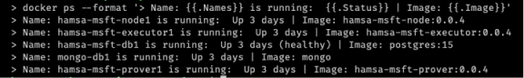

# Implantação de ZK-Rollup

#### Cenários de instalação

[Implantação de ZK-Rollup em máquina virtual dedicada](#starting-up-node)

[Implantação de ZK-Rollup em um único servidor](#nodes-same-host)

---

<!-- Após o preenchimento requerido na [etapa anterior](./Environment_Setup.md) para cada Node, cada um poderá ser inicializado: -->

### <a name="starting-up-node"></a>Inicializando cada Node em sua determinada máquina virtual.

Este processo de instalação prevê que cada nó ZK-Rollup seja instaladao em uma máquian virtual diferente.

<br />

> Ainda na pasta do demo, os parâmetros de configuração necessários para cada node são declarados em arquivos `./server/node{1,2 ou 3}/.env`.
> 
> `L1_URL` deve ser preenchido com o IP/URI do Hyperledger Besu. Exemplo: <IP | URI>:8545 \
> `L1_CHAINID` é o `CHAINID` fornecido pelo BACEN \
> `DVP_L1MATCHSCADDRESS` deve ter o mesmo valor nos 3 nodes \
> `DVP_L1MATCHSUBMITTERKEYS`: Cada node deve preencher com 2 chaves privadas que estejam no arquivo `hardhat.config.js`, desde que não tenham sido usadas em outros nodes. \
> `L1_DEPLOYERKEY`: deve ser preenchido por uma das chaves do arquivo `hardhat.config.js`, ser diferente das chaves usadas em `DVP_L1MATCHSUBMITTERKEYS` e não ter sido usada em outro nó da mesma forma.
>
> No arquivo `hardhat.config.js` já existem chaves privadas representando contas.
> 
> ATENÇÃO: As chaves mencionadas acima devem estar no arquivo `hardhat.config.js` em `networks.[NODE SERVER | EVM].accounts`

1) Faça o upload da pasta referente ao servidor ZK-Rollup para a máquina virtual desejada por SFTP ou método adequad. Exemplo: 

  ```bash
  > sftp <MARQUINA VIRTUAL>
  > put server/node1 ./<destino da maquina virtual>
  ```

2) Acesse a máquina virtual remotamente (Exemplo: SSH) e navegue para o diretório com o conteúdo do upload acima.
3) Através de acesso à linha comando dentro de cada máquina virtual e dentro da pasta 

    ```bash
    docker compose up -d
    ```

4) Conferindo a inicialização de todos os serviços: Node, Executor e Prover (Rollup):

    ```bash
    docker ps --format '> Name: {{.Names}} is running:  {{.Status}} | Image: {{.Image}}'
    ```

    

O resultado semelhante a imagem acima afirma que os serviços foram inicializados.

### <a name="nodes-same-host"></a>Implantação de servidores ZK-Rollup em um único servidor

Este cenário de instalação prevê a implantação de todos os nós de ZK-Rollup em mesmo host.

<br />

> Ainda na pasta do demo, os parâmetros de configuração necessários estão no arquivo `.env` na raiz do diretório.
> 
> `L1_URL` deve ser preenchido com o IP/URI do Hyperledger Besu. Exemplo: <IP | URI>:8545 \
> `L1_CHAINID` é o `CHAINID` fornecido pelo BACEN \
> `DVP_L1MATCHSCADDRESS` deve ter o mesmo valor nos 3 nodes \
> `DVP_L1MATCHSUBMITTERKEYS`: Cada node deve preencher com 2 chaves privadas que estejam no arquivo `hardhat.config.js`, desde que não tenham sido usadas em outros nodes. \
> `NODE{1, 2 e 3}_L1_DEPLOYERKEYS`: deve ser preenchido por duas das chaves do arquivo `hardhat.config.js`, ser diferente das chaves usadas em `DVP_L1MATCHSUBMITTERKEYS` e não ter sido usada em outro nó da mesma forma. \
> `NODE{1, 2 e 3}_DVP_L1MATCHSUBMITTERKEYS` deve conter duas chaves privadas configuradas no Hyperledger Besu através da respectiva ZK-Rollup (devem ser diferentes entre os nós)
>
> No arquivo `hardhat.config.js` já existem chaves privadas representando contas.
> 
> ATENÇÃO: As chaves mencionadas acima devem estar no arquivo `hardhat.config.js` em `networks.[NODE SERVER | EVM].accounts`

Para que em um processo só os 3 nodes sejam implantados no host (exemplo: docker local) siga os passos abaixo:

1. Abra o arquivo `.env` localizado na raiz do diretório;
2. Altere a variável abaixo:
   - `L1_URL`: Endereço do servidor Hyperledger Besu;
   - `L1_CHAINID`: CHAINID do seu ambiente Hyperledger Besu;
   
   Execute o comando abaixo para implantar todos os serviços juntos:
    ```bash
    docker compose up -d
    ```

    > Não esqueça de conferir se todos os serviços foram iniciados. Por exemplo: `docker ps --format 'Image: {{.Image}} | Name: {{.Names}} | Image:  {{.Image}}'`


### Troubleshooting

1) Em caso de atualização do versão das imagens, se faz necessário:
    - descarregue as novas imagens;

    - interrompa os serviços;

      ```bash
      docker-compose down
      ```

    - carregar as novas imagens no respositório docker da respectiva máquina virtual;
      ```bash
      docker load -i ./<local da imagem>hamsa-msft-{executor | node | prover}:<version>
      ```

    - atualizar o arquivo `.env` com as devidas versões; 

       

    - se necessário limpar a base de dados (volume apontado para a pasta `./db ` do respectivo Node), exemplo: `./server/node{1, 2 e 3}/db`.
      ```bash
      rm -Rf ./db
      ```

      > procedimento é o mesmo em ambos os cenários de instalação, para cada nó de ZK-Rollup.
      > - Maquina virtual dedicada: localize o diretório `./db` 

    - inicializar novamente os serviços
      ```bash
      docker-compose up -d
      ```

----

<div class="footer">
<p><a href="./Pos_Environment_Setup.md">Finalização da configuração do ambiente demo ></a></p>
<p><a href="./Environment_Setup.md">< Configuração do ambiente Demo e pré-configuração do ZK-Rollup</a></p>
<p><a href="./README.md">Inicio</a></p>
</div>