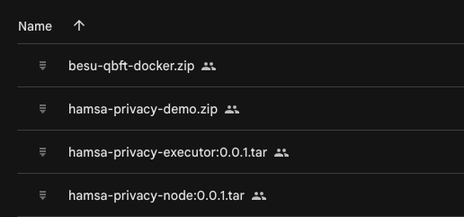
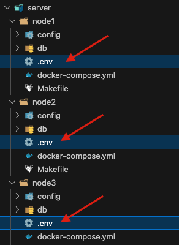
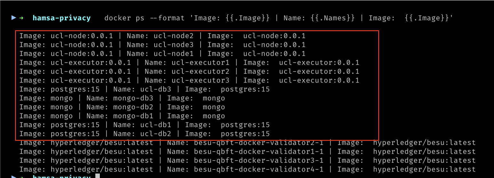
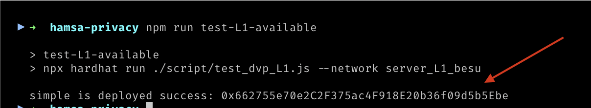

# Hamsa Privacy built on Microsoft Nova ZKP

- [Hamsa Privacy built on Microsoft Nova ZKP](#hamsa-privacy-built-on-microsoft-nova-zkp)
  - [Pré-requisitos](#pré-requisitos)
  - [Instalação](#instalação)
    - [Material base da instalação](#material-base-da-instalação)
    - [ Layer 1 - Hyperledger Besu](#-layer-1---hyperledger-besu)
    - [Layer 2 - Docker images dos nodes privados](#layer-2---docker-images-dos-nodes-privados)
    - [Ambiente Demo](#ambiente-demo)
      - [ Configuração do arquivo hardhat.config.js](#-configuração-do-arquivo-hardhatconfigjs)
      - [Compilação dos smart contracts, Implantação do DVP-Match e Rollup na Layer 1](#compilação-dos-smart-contracts-implantação-do-dvp-match-e-rollup-na-layer-1)
      - [Implantação os nodes](#implantação-os-nodes)
      - [Implantação rápida](#implantação-rápida)
    - [Implantando os nodes de modo segregado](#implantando-os-nodes-de-modo-segregado)
      - [Banco Central/SELIC](#banco-centralselic)
      - [Banco A](#banco-a)
      - [Banco B](#banco-b)
  - [Testing availability of the services:](#testing-availability-of-the-services)
    - [Testando a disponibilidade da Layer 1](#testando-a-disponibilidade-da-layer-1)
    - [Testando a disponibilidade dos nós da Layer 2](#testando-a-disponibilidade-dos-nós-da-layer-2)


## <a name="requirements"></a>Pré-requisitos

- Docker
  - imagens preparadas para ambiente Debian
- Make software
- Nodejs 20.17.0+

> ATENÇÃO: Para a conclusão dos procedimentos a seguir, é necessário o uso de um programa de linha de comando e que o perfil tenha permissões para que os comandos sugeridos sejam executados sem restrições que comprometam a instalação e/ou execução dos testes.

## <a name="instalação"></a>Instalação

### <a name="material-base-da-instalação"></a>Material base da instalação

- Docker image contendo uma cópia para emulação local do Hyperledger Besu, ambiente Layer 1;
- Docker images para os nós do ambiente Layer 2;
- Pacote contendo o ambiente de demo. Ou seja, a implantação de ambiente Layer 2 e scripts para testes;



[BAIXE AQUI OS ARQUIVOS ACIMA](https://drive.google.com/drive/folders/1ublgmo-kNgNhnVB7ieUWr0hL1bgmJKuf?usp=sharing)

### <a name="layer-1---hyperledger-besu"></a> Layer 1 - Hyperledger Besu

1. Faça o download do arquivo ```besu-qbft-docker.zip``` e extraia seu conteúdo.
2. Execute o comando abaixo para que o ambiente de Layer 1 esteja já disponível para os próximos passos.
  ```bash
  cd [nome da pasta extraida]

  docker compose up -d
  ```
1. Para conferir se o servidor está rodando execute o comando abaixo e localize o termo ```besu-qbft-docker```
  ```bash
  docker ps --format 'Image: {{.Image}} | Name: {{.Names}} | Image:  {{.Image}}'
  ```


### <a name="layer-2---docker-images-dos-nodes-privados"></a>Layer 2 - Docker images dos nodes privados

1. Faça o download das imagens abaixo:
   1. ```hamsa-privacy-executor:0.0.1.tar```
   2. ```hamsa-privacy-node:0.0.1.tar```
2. Após realizar o download, navegue via prompt de comando para a pasta destino dos downloads acima e execute o seguintes comandos:
     
    ```bash
    docker load -i hamsa-privacy-node:0.0.1.tar
    ```
    
   ```bash
   docker load -i hamsa-privacy-executor:0.0.1.tar
   ```

   Este comando adicionará as imagens ao repositório Docker local e as disponibilizará para os próximos passos. 

### <a name="ambiente-demo"></a>Ambiente Demo

1. Faça o download do arquivo do link abaixo e extraia seu conteúdo:
   
   ```hamsa-privacy-demo.zip```

2. Pelo prompt de comando, acesse o diretório:
    ```bash
    cd hamsa-privacy-demo
    ```
#### <a name="hardhat-settings"></a> Configuração do arquivo hardhat.config.js

1. Abra o arquivo hardhat.config.js em seu software de edição de preferência e atualize-o com o IP do docker host.

    

2. As chaves privadas das contas na Layer 1 não precisam ser modificadas. Caso você esteja usando sua própria blockchain Layer 1, atualize o arquivo com as sua próprias chaves.

#### <a name="contracts-compilation"></a>Compilação dos smart contracts, Implantação do DVP-Match e Rollup na Layer 1

1. Execute os seguintes comandos para realizar instalação das dependências e compilar os smart contracts
    
    > instalação das dependências
     ```bash
    npm i
    ```

    > compilação dos smart contracts
    ```bash
    npx hardhat compile
    ```
2. Implantação do DVP-Match e Rollup, execute o comando abaixo:

    ```bash
    npm run deploy-dvp-match-server-L1
    ```

    O resultado esperado será seguindo o seguindo o exemplo abaixo:<a name="dvp-math-hash" />

    

3. Um endereço `L1MatchScAddress` será gerado para substituir os campos
   1.  `DVP_L1MATCHSCADDRESS` no arquivo `.env` que consta na pasta raiz do ambiente demo.
   2.  `DVP_L1MATCHSCADDRESS` nos arquivos `.env` que estão nas pastas de cada node em `./server/node1`, `./server/node2` e `./server/node3`.


> #### Por que temos mais de um arquivo `.env`?
> 
> *O deploy dos nodes pode ser feito através do arquivo `./docker-compose.yml` localizado na raiz do diretório da demo, onde todos os node são implantados em lote. Mas há possibilidade de deploy dos nodes de forma isolada  desde que o arquivo `.env` de cada node seja devidamente atualizado com o `DVP_L1MATCHSCADDRESS` gerado no deploy da Layer 1.*


#### <a name="nodes-deployment"></a>Implantação os nodes

Abaixo serão implantados 3 nodes, Banco A, Banco B e Banco Central/SELIC. O processo é semelhante para todos os nodes.

Os parâmetros de configuração necessários para cada node são declarados em arquivos `.env`. No arquivo `hardhat.config.js` já existem chaves privadas representando contas.

 

> A variável `DVP_L1MATCHSCADDRESS` deve ter o mesmo valor nos 3 nodes.
> Cada node deve  preencher a variável `DVP_L1MATCHSUBMITTERKEYS` com 2 chaves privadas que estejam no arquivo `hardhat.config.js`, mas elas não  podem se repetir entre eles.

#### Implantação rápida

Para que em um processo só os 3 nodes sejam implantados no mesmo ambiente (exemplo: docker local) siga os passos abaixo:

1. Abra o arquivo `.env` localizado na raiz do diretório;
2. Altere as variáveis abaixo:
   - `L1_URL`: Endereço do serviço Layer 1.
   - `DVP_L1MATCHSCADDRESS`: Hash de implantação da Layer 1 (veja em: [Compilação dos smart contracts, Implantação do DVP-Match e Rollup na Layer 1](#dvp-math-hash))
   
   Execute o comando abaixo para implantar todos os serviços juntos:
    ```bash
    docker compose up -d
    ```

    > Não esqueça de conferir se todos os serviços foram iniciados. Por exemplo: `docker ps --format 'Image: {{.Image}} | Name: {{.Names}} | Image:  {{.Image}}'`

    

### Implantando os nodes de modo segregado

#### <a name="central-bank"></a>Banco Central/SELIC
> ./server/node1

Altere os valores das variáveis de ambiente abaixo no arquivo `.env`:

1. `L1_URL`: Endereço do serviço Layer 1.
2. `DVP_L1MATCHSCADDRESS`: Hash de implantação do DVP-Match (veja em: [Compilação dos smart contracts, Implantação do DVP-Match e Rollup na Layer 1](#dvp-math-hash)).

Execute o comando abaixo ainda na pasta:

```bash
docker compose up -d
```


#### <a name="bank-a"></a>Banco A
> ./server/node2

Altere os valores das variáveis de ambiente abaixo no arquivo `.env`:

1. `L1_URL`: Endereço do serviço Layer 1.
2. `DVP_L1MATCHSCADDRESS`: Hash de implantação do DVP-Match (veja em: [Compilação dos smart contracts, Implantação do DVP-Match e Rollup na Layer 1](#dvp-math-hash)).

Execute o comando abaixo ainda na pasta:

```bash
docker compose up -d
```


#### <a name="bank-b"></a>Banco B
> ./server/node3

Altere os valores das variáveis de ambiente abaixo no arquivo `.env`:

1. `L1_URL`: Endereço do serviço Layer 1.
2. `DVP_L1MATCHSCADDRESS`: Hash de implantação do DVP-Match (veja em: [Compilação dos smart contracts, Implantação do DVP-Match e Rollup na Layer 1](#dvp-math-hash)).

Execute o comando abaixo ainda na pasta:

```bash
docker compose up -d
```

## <a name="testing-availability"></a>Testing availability of the services:

### Testando a disponibilidade da Layer 1

Execute o comentao abaixo:

```bash
npm run test-L1-available
```

Resultado esperado



### Testando a disponibilidade dos nós da Layer 2

Execute o comentao abaixo:

```bash
npm run test-L2-available
```


